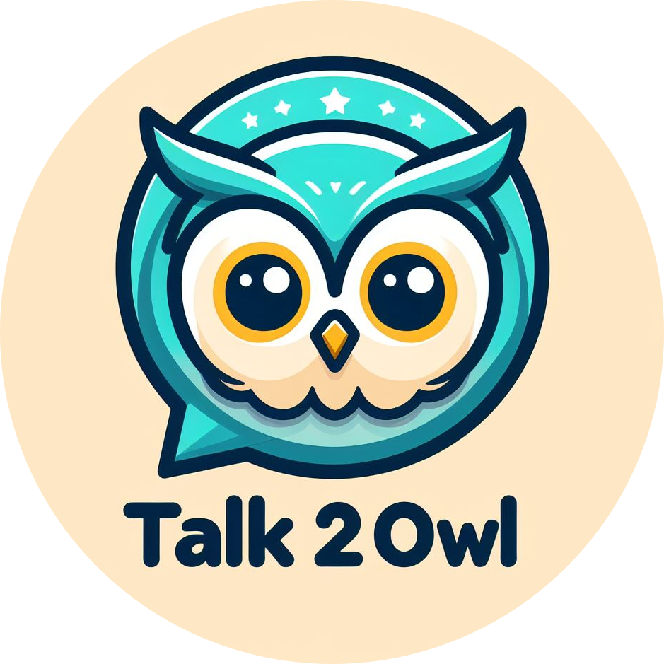
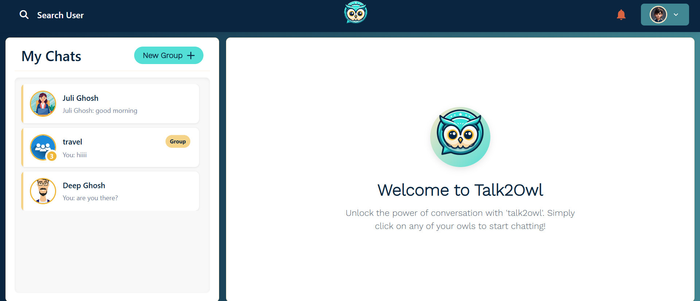
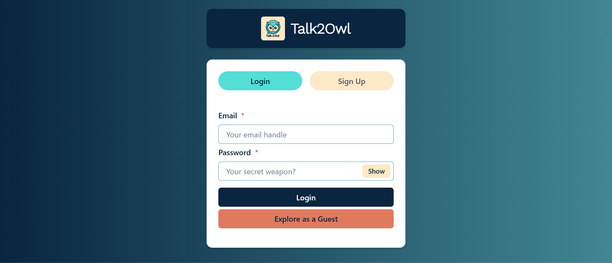
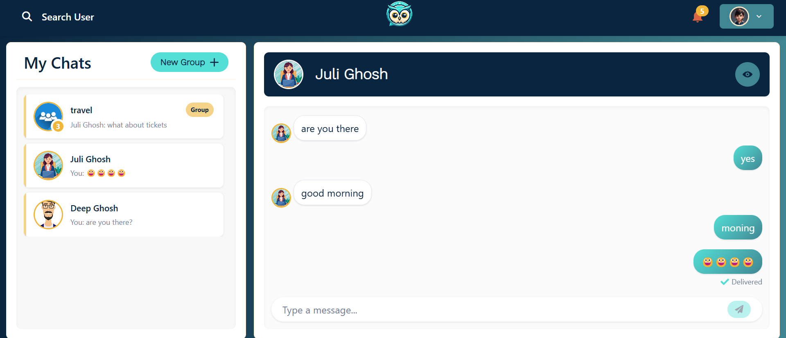
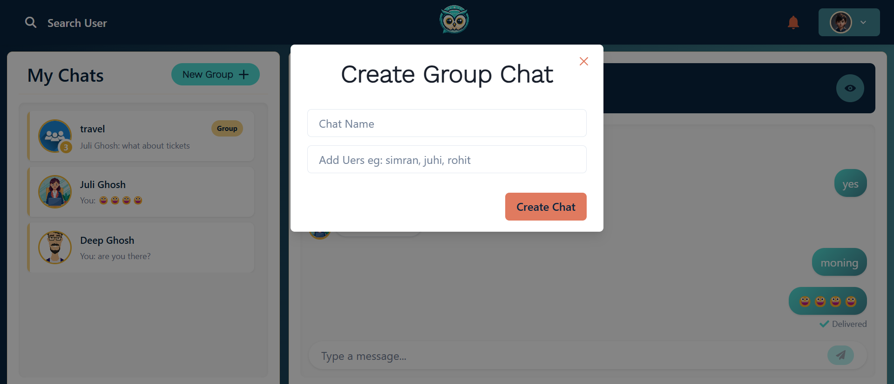
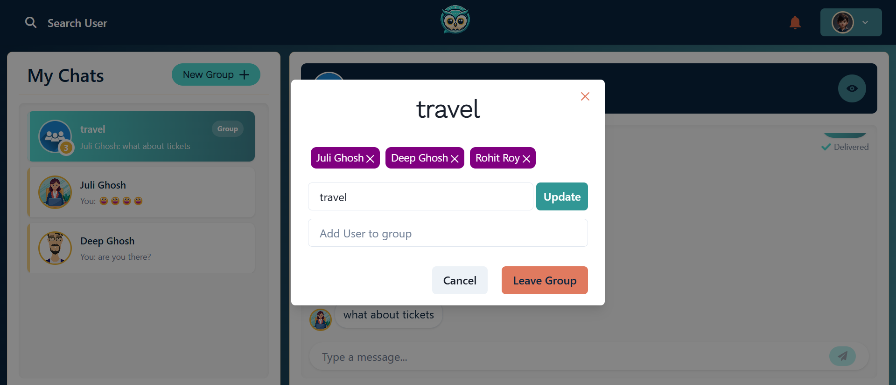
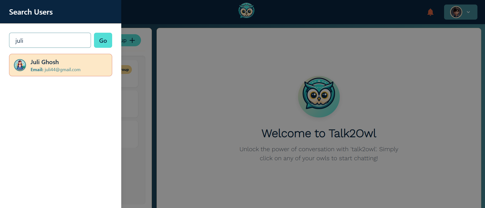
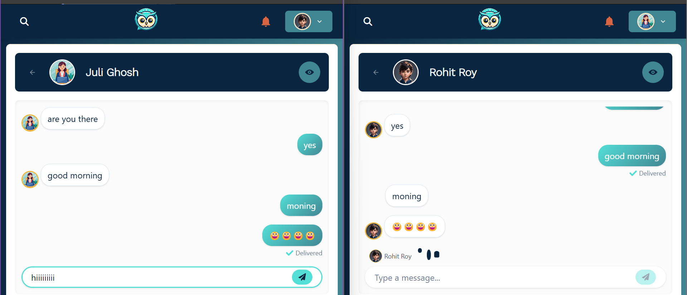
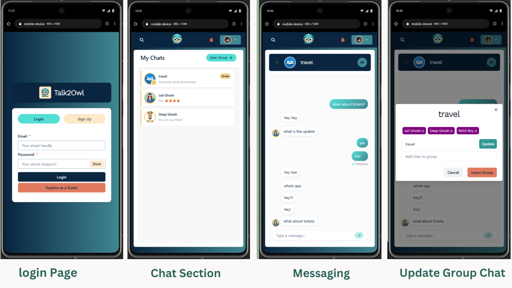

# 💬 Talk2Owl

<p align="center">
  
</p>

_**Talk2Owl** – A sophisticated real-time messaging platform built with modern web technologies, offering seamless communication, interactive typing indicators, delivered indicators, and comprehensive notification systems in an elegant, responsive interface._

## ✨ What This Project Does

**Talk2Owl** is a feature-rich chat application where users can connect and communicate in real time. The platform offers comprehensive messaging capabilities with instant message delivery confirmations and real-time typing indicators. Users can engage in one-on-one conversations or create group chats with multiple participants. The application provides a complete notification system to ensure users never miss important messages, even when they're not actively viewing a specific chat. With a clean, minimalist design, Talk2Owl prioritizes ease of use while maintaining a professional appearance across all devices.

## 🚀 Live Demo

Experience the project in action:

- 🌐 [Live Demo Link](https://your-demo-link.com)
- 🎥 [Video Demo](https://your-video-demo-link.com)

## 📸 Preview

### 🏠 Chat Page



_Access all your conversations with message previews and profile avatars in one centralized interface._

---

## 🎞️ Interactive Previews

### 🔑 Getting Started


_From SignUp to Chat, Groups & Notifications – See It All in Action!._

### 💬 Real-Time Messaging


_Real-Time Messaging in Action: Delivery, Notifications & Typing Live._

## 📷 Additional Screenshots

### SignUp Page

<details>
<summary>View Screenshot</summary>



_Create a new account or sign in to access your conversations._

</details>

### Chat Interface

<details>
<summary>View Screenshot</summary>



_Clean, intuitive messaging interface with conversation history and real-time indicators._

</details>

### Group Chat Management

<details>
<summary>View Screenshot</summary>



_Create and manage group conversations with multiple participants simultaneously._

</details>

### Update Group Chat

<details>
<summary>View Screenshot</summary>



_Update group chat name, add or remove users, and manage group members based on admin privileges or user departure._

</details>

### User Search

<details>
<summary>View Screenshot</summary>



_Easily find and connect with other users through the intuitive search functionality._

</details>

### Realtime Messaging

<details>
<summary>View Screenshot</summary>



_real-time messaging with typing indicators showing who is typing and delivered status for sent messages._

</details>

### Mobile Responsive Design

<details>
<summary>View Screenshot</summary>



_Access all features seamlessly across any device with our fully responsive design._

</details>

## ✨ Features

- 🔑 **Authentication System**: Secure login and registration for user account management.
- 💬 **Real-Time Messaging**: Instant message delivery between users with no refresh needed.
- ⌨️ **Live Typing Indicators**: See when your friends are typing with user identification.
- 🔔 **Comprehensive Notifications**: Receive alerts for new messages when not in active chat.
- 👥 **Group Chat Functionality**: Create and participate in conversations with multiple users.
- 👑 **Admin Controls**: Manage group membership, edit group names, and moderate conversations.
- ✅ **Message Delivery Status**: Track whether messages have been successfully delivered.
- 🔍 **User Search**: Find and connect with other registered users through search functionality.
- 👤 **Profile Management**: View and manage personal profile information.
- 📱 **Fully Responsive Design**: Seamless experience across desktop, tablet, and mobile devices.
- 🎨 **Minimalist UI/UX**: Clean, intuitive interface that prioritizes ease of use.
- 🚪 **Group Exit Options**: Leave groups or remove members (with admin privileges).

## 🛠 Tech Stack

### 🚀 Frontend

- **Framework**: React
- **State Management**: Context API
- **Networking**: Axios
- **WebSocket**: Socket.IO for real-time communication
- **Routing**: React Router DOM
- **UI Components**: Chakra UI 
- **Notifications**: react-notification-badge
- **Scrolling**: react-scrollable-feed

### 🖥️ Backend

- **Server**: Node.js with Express.js
- **Database**: MongoDB (Mongoose ORM)
- **Authentication**: JWT with bcrypt for password hashing
- **Real-Time Communication**: Socket.IO


### 🚢 Deployment

- **Frontend**: Vercel 
- **Backend**: Render 


## 🔧 Installation

1. Clone the repository and navigate to the project folder:

   ```bash
   git clone https://github.com/yourusername/talk2owl.git
   cd talk2owl
   ```

2. Install dependencies for both frontend and backend:

   ```bash
   cd client
   npm install
   ```

   Open a new terminal:

   ```bash
   cd server
   npm install
   ```

3. Start the development servers:

   Backend:

   ```bash
   npm run dev
   ```

   Frontend:

   ```bash
   npm start
   ```

## 🎮 Usage

- The app will be available locally at `http://localhost:3000`.

Accessing the Backend:

- Visit http://localhost:5000/ in your browser to check the API.

## 🤝 Contributing

We welcome contributions! Please follow these steps:

1. Fork the repository
2. Create your feature branch (`git checkout -b feature/AmazingFeature`)
3. Commit your changes (`git commit -m 'Add some AmazingFeature'`)
4. Push to the branch (`git push origin feature/AmazingFeature`)
5. Open a Pull Request

## 📬 Contact

- Your Name - [@yourtwitter](https://twitter.com/yourtwitter)
- Email - your.email@example.com
- Project Link: [https://github.com/yourusername/talk2owl](https://github.com/yourusername/talk2owl)

## 📊 Project Metrics

&nbsp;&nbsp;&nbsp;&nbsp;
&nbsp;&nbsp;&nbsp;&nbsp;
&nbsp;&nbsp;&nbsp;&nbsp;
&nbsp;&nbsp;&nbsp;&nbsp;


## 💻 Project Details

&nbsp;&nbsp;&nbsp;&nbsp;
&nbsp;&nbsp;&nbsp;&nbsp;
&nbsp;&nbsp;&nbsp;&nbsp;
&nbsp;&nbsp;&nbsp;&nbsp;

### 📊 Project Overview

| 📌 **Metric**          | 📊 **Value**     |
| ---------------------- | ---------------- |
| 📈 **Total Commits**   | 952              |
| 🕒 **Last Commit**     | 2024-03-01       |
| 💾 **Repo Size**       | 14.2 MB          |
| 📝 **Languages Count** | 3                |
| 💡 **Top Language**    | JavaScript - 68% |
| ❓ **Open Issues**     | 3                |
| 🌐 **Platform**        | Web, Mobile      |
| 📦 **Dependencies**    | 14               |
| 📅 **Version**         | 1.0.0            |
| 🚀 **Status**          | Deployed         |

## 🚀 Upcoming Future Feature Progress

- 📎 **File & Media Sharing**: Support for sharing documents, images, and other media ░░░░░░░░░░░░░░░░░░░░░░ 0%

- 🔍 **Message Search**: Search functionality within conversations ▓░░░░░░░░░░░░░░░░░░░░░ 10%

Made with ❤️ by [Your Name](https://github.com/yourusername)
